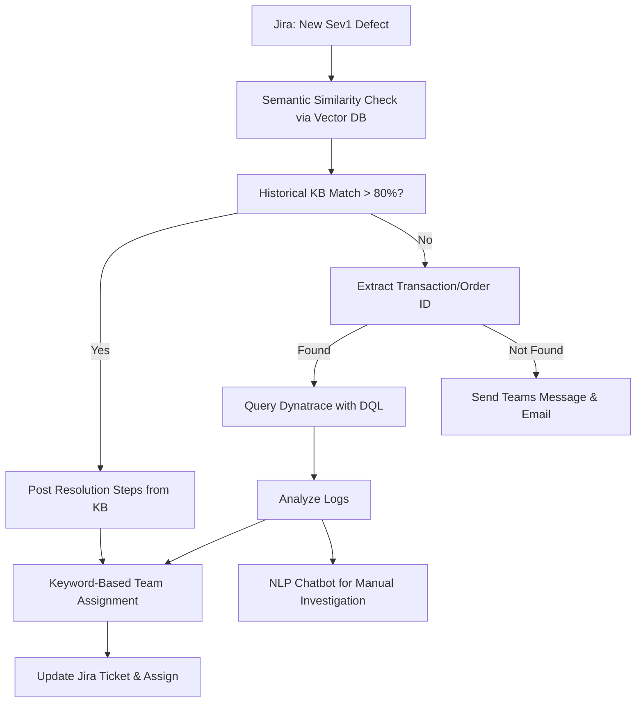

# 📘 SLM-Based Sev1 Defect Automation System Documentation

**Date:** 2025-08-03

---

## 🧩 Objective

To automate the triage and resolution flow of Sev1 defects raised in Jira using a Small Language Model (SLM). This includes:

- Identifying duplicate issues
- Extracting transaction identifiers
- Fetching Dynatrace logs
- Assigning to appropriate dev teams
- Providing a fallback NLP interface

---

## 🗂️ Components Overview



---

## 📂 Data Files

### 1. Historical Knowledge Base (CSV)
```csv
Defect_ID,Summary,Issue_Description,Flow,Severity,Reported_By_App,Resolution_Steps,Solving_Team
DEF-123,"Login Failure","User cannot login to platform",AuthService,Sev1,web-app,"Restart auth-service","Identity-Access-Team"
```

### 2. Keyword-to-Team Map (CSV)
```csv
Keyword,Application,Assignment_Team
database,Database Module,Platform-Infra-Team
payment-gateway,Payments-Service,Payments-Dev-Team
authentication,Login Module,Identity-Access-Team
```

---

## 🧠 Vector DB Configuration

- **Embedding Model**: Hugging Face (`sentence-transformers/all-MiniLM-L6-v2`)
- **Vector Store Options**:
  - **FAISS** (best for local, fast prototyping)
  - **Pinecone/Weaviate** (cloud, scalable production usage)
- **Update Frequency**: Daily batch embedding of new historical tickets

---

## 🔍 Dynatrace Query Logic

DQL Sample:
```sql
fetch logs
| scanLimitGBytes: 500
| samplingRatio: 1000
| filter (matchesPhrase(content, "order id|transaction id")) and (matchesPhrase(content, "xxxx"))
| sort timestamp desc
```

Required: Dynatrace API Token & Access Scope

---

## 📡 Manual Fallback - NLP Interaction Window

**Chatbot Integration**: Microsoft Teams

**Command Sample**:
```
User: investigate order_id ABC123
Bot:
- Order ID: ABC123
- Error: Payment timeout in payment-service
- Suggested Team: Payments-Dev-Team
- Suggested Action: Restart container
```
Output will include:
- Time of issue
- Error type
- Team mapping
- Full Dynatrace log link

---

## 🛠️ Technologies Used

| Component             | Tool/Tech                        |
|-----------------------|----------------------------------|
| Jira API              | Jira Cloud REST API              |
| Embeddings            | Hugging Face Transformers        |
| Vector Database       | FAISS / Pinecone / Weaviate      |
| Dynatrace Logs        | Dynatrace API + DQL              |
| Notifications         | Microsoft Teams / Email SMTP     |
| NLP Fallback          | OpenAI / Rasa Chatbot            |
| Data Flow Protocol    | Custom Model Context Protocol    |

---

## ✅ First Task: MVP Flow Execution

- Create both CSVs with real data (10–20 samples)
- Embed and ingest into vector DB
- Setup JQL to pull new Sev1 Jira issues
- Implement Dynatrace DQL query integration
- Wire fallback alert via Teams
- Build NLP Bot interface

---

Modular Components Breakdown
Here's how you can structure your system in a modular way:
Module
Purpose
Input
Output
JiraFetcher
Fetch Sev1 tickets from Jira
JQL
JSON Defect Payload
VectorEmbedder
Create embeddings from descriptions
Text
Embedding vector
VectorSearcher
Compare new defect with historical KB
Embedding vector
Top matches + score
IDExtractor
Extract Transaction ID
Text
ID string or None
DynatraceQuerier
Query logs using DQL
ID
Log summary
TeamAssigner
Decide dev team using KB or keyword map
Description / Logs
Team name
JiraUpdater
Post comments + assign ticket
Team name, summary
API status
NotificationSender
Teams/email alert if manual intervention
Ticket info
Message sent
NLPChatbot
User queries logs via ID
Query text
Formatted response
